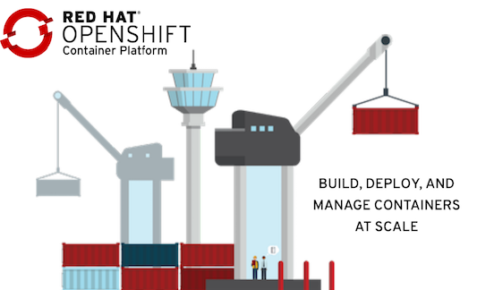

# Container Platform - Demo
<!-- TOC -->

- [Container Platform - Demo](#container-platform---demo)
  - [Create Namespaces](#create-namespaces)
  - [Deploy Application](#deploy-application)
  - [Test Namespace's Quotas](#test-namespaces-quotas)
  - [Blue/Green Deployment with OpenShift Route](#bluegreen-deployment-with-openshift-route)
  - [Horizontal Pod Autoscaler](#horizontal-pod-autoscaler)
  - [East-West Security](#east-west-security)
  - [North-South Security and control](#north-south-security-and-control)
- [Service Mesh](#service-mesh)
  - [Setup](#setup)
  - [Secure Backend by mTLS](#secure-backend-by-mtls)
  - [Secure frontend by JWT](#secure-frontend-by-jwt)

<!-- /TOC -->



## Create Namespaces
Create namespace for user1 and user2
- user1 can edit namespace1 and namespace2
- user2 can edit namespace3
```bash
oc login --insecure-skip-tls-verify=true --server=$OCP --username=opentlc-mgr
oc new-project namespace-1 --display-name="Namespace 1"
oc label namespace namespace-1 name=namespace-1
oc new-project namespace-2 --display-name="Namespace 2"
oc label namespace namespace-2 name=namespace-2
oc new-project namespace-3 --display-name="Namespace 3"
oc label namespace namespace-3 name=namespace-3
oc policy add-role-to-user edit user1 -n namespace-1 
oc policy add-role-to-user edit user1 -n namespace-2
oc policy add-role-to-user edit user2 -n namespace-3
```
- Assign quotas to namespaces
```bash
oc apply -f artifacts/size-s-quotas.yaml -n namespace-1
oc apply -f artifacts/size-s-quotas.yaml -n namespace-2
oc apply -f artifacts/size-s-quotas.yaml -n namespace-3
```

## Deploy Application
- Deploy frontend and backend app using deployment config yaml files.
 ** Remark: consider to deploy using helm chart**
```bash
oc login --insecure-skip-tls-verify=true --server=$OCP --username=user2
oc apply -f artifacts/dummy.yaml -n namespace-3
oc login --insecure-skip-tls-verify=true --server=$OCP --username=user1
oc apply -f artifacts/backend.yaml -n namespace-2
#Need to fix expose dc because service port format is not comply with kiali
oc expose dc/backend -n namespace-2
oc apply -f artifacts/frontend.yaml -n namespace-1
oc expose dc/frontend -n namespace-1
oc create route edge frontend --service=frontend --port=8080 -n namespace-1
echo "Front End URL=> https://$(oc get route frontend -o jsonpath='{.spec.host}' -n namespace-1)"
```
- Check Administration and Develor Console for applications's configuration, Namespace quotas and namespace's utilization.
  
## Test Namespace's Quotas
- Scale pod to 8
```bash
oc scale dc/backend --replicas=8 -n namespace-2
```
- Check Web Console for namespace's resource quotas.
- Create 3 more pods. This will exceeded quota's of request CPU and memory.
- Scale down to 1 pod and add persistent volume claim (PVC) to pod. Then scale to 2 pod and check namespace's resource quotas. (Still cannot scale need to fix this)
```bash
oc scale dc/backend --replicas=1 -n namespace-2
#Remark: still not work. Cannot scale pod
oc set volume dc/backend --add --name=data --type=persistentVolumeClaim --claim-name=backend \
--claim-size=50M --claim-mode='ReadWriteOnce' --mount-path=/data --containers=backend -n namespace-2
oc scale dc/backend --replicas=2 -n namespace-2
```
- Remove (PVC)
```bash
oc set volume dc/backend --remove --name=data -n namespace-2
```

## Blue/Green Deployment with OpenShift Route
- deploy frontend-v2 on namespace-1
```bash
oc apply -f artifacts/frontend-v2.yaml -n namespace-1
oc expose dc/frontend-v2 -n namespace-1
```
- Run test script to frontend route
```bash
scripts/loop-frontend.sh
```
- Sample output
```log
Loop: 1
Frontend version: v1 => [Backend: http://backend.namespace-2.svc.cluster.local:8080, Response: 200, Body: Backend version:v1, Response:200, Host:backend-1-srrhl, Status:200, Message: Hello, World]
Loop: 2
Frontend version: v1 => [Backend: http://backend.namespace-2.svc.cluster.local:8080, Response: 200, Body: Backend version:v1, Response:200, Host:backend-1-srrhl, Status:200, Message: Hello, World]
Loop: 3
Frontend version: v1 => [Backend: http://backend.namespace-2.svc.cluster.local:8080, Response: 200, Body: Backend version:v1, Response:200, Host:backend-1-srrhl, Status:200, Message: Hello, World]
```
- Blue/Green deployment by configure frontend route to switch to frontend-v2 ( on another terminal)
```bash
scripts/blue-green-deployment.sh
```
- [blue-green-deployment.sh](blue-green-deployment.sh) configure route to point to service frontend-v2
```bash
oc patch route frontend  -p '{"spec":{"to":{"name":"'frontend-v2'"}}}' -n namespace-1
#Switch back to v1
oc patch route frontend  -p '{"spec":{"to":{"name":"'frontend'"}}}' -n namespace-1
```
- Check Result
```log
Loop: 3
Frontend version: v1 => [Backend: http://backend.namespace-2.svc.cluster.local:8080, Response: 200, Body: Backend version:v1, Response:200, Host:backend-1-srrhl, Status:200, Message: Hello, World]
Loop: 4
Frontend version: v2 => [Backend: http://backend.namespace-2.svc.cluster.local:8080, Response: 200, Body: Backend version:v1, Response:200, Host:backend-1-srrhl, Status:200, Message: Hello, World]
Loop: 5
Frontend version: v2 => [Backend: http://backend.namespace-2.svc.cluster.local:8080, Response: 200, Body: Backend version:v1, Response:200, Host:backend-1-srrhl, Status:200, Message: Hello, World]
```

## Horizontal Pod Autoscaler
WIP

## East-West Security
- Frontend App in namespace namespace-1 accept only request from OpenShift's router in namespace openshift-ingress
```bash
oc apply -f artifacts/network-policy-deny-from-all.yaml -n namespace-1
oc apply -f artifacts/network-policy-allow-network-policy-global.yaml -n namespace-1
```
- Network Policy for namespace-1
```yaml
apiVersion: networking.k8s.io/v1
kind: NetworkPolicy
metadata:
  name: deny-from-all
spec:
  podSelector: {}
  ingress: []
---
apiVersion: networking.k8s.io/v1
kind: NetworkPolicy
metadata:
  name: allow-network-policy-global
spec:
  podSelector: {}
  ingress:
    - from:
        - namespaceSelector:
            matchLabels:
              network-policy: global
  policyTypes:
    - Ingress
```
- Backend App in namespace namespace-1 accept only request from namespace-1 and must contains label app=frontend
```
oc apply -f artifacts/network-policy-deny-from-all.yaml -n namespace-2
oc apply -f artifacts/network-policy-allow-from-namespace-1.yaml -n namespace-2
```
- Network Policy for namespace-2
```yaml
apiVersion: networking.k8s.io/v1
kind: NetworkPolicy
metadata:
  name: deny-from-all
spec:
  podSelector: {}
  ingress: []
---
apiVersion: networking.k8s.io/v1
kind: NetworkPolicy
metadata:
  name: allow-from-namespace-1
spec:
  podSelector:
    matchLabels:
      app: backend
  ingress:
    - from:
        - namespaceSelector:
            matchLabels:
              name: namespace-1
```

## North-South Security and control
- For ingress traffic, IP whitelist can be set to each route.
```bash
oc annotate route frontend haproxy.router.openshift.io/ip_whitelist=13.52.0.0/16 -n namespace-1
```
- For ingress traffic, set rate limits for http protocol to 5. Each router will limit request for each IP for 5 request/sec (Our environment has 2 routers then total limit is 10 requests)
```bash
oc annotate route frontend haproxy.router.openshift.io/rate-limit-connections=true -n namespace-1
oc annotate route frontend haproxy.router.openshift.io/rate-limit-connections.rate-http=5 -n namespace-1
```
- For egress traffic, set egress firewall to allow only specific destination. 
```bash
oc apply -f artifacts/egress-namespace-2.yaml -n namespace-2
```
- Egress policy to deny all external IP except DNS name httpbin.org
```yaml
kind: EgressNetworkPolicy
apiVersion: v1
metadata:
  name: egress-namespace-2
spec:
  egress: 
  - type: Allow
    to:
      dnsName: httpbin.org
  - type: Deny
    to:
      cidrSelector: 0.0.0.0/0
```


# Service Mesh

## Setup
- Create namespace for control plane
```bash
oc login --insecure-skip-tls-verify=true --server=$OCP --username=opentlc-mgr
oc new-project user1-istio-system --display-name="Service Mesh Control Plane for user1"
oc label namespace user1-istio-system network-policy=istio-system
oc policy add-role-to-user edit user1 -n user1-istio-system
oc apply -f artifacts/network-poliy-allow-from-istio-system.yaml -n namespace-1
oc apply -f artifacts/network-poliy-allow-from-istio-system.yaml -n namespace-2
```
- Create control plane and join namespace-1 and namespace-2 to control plane
```bash
oc login --insecure-skip-tls-verify=true --server=$OCP --username=user1
oc apply -f artifacts/service-mesh-basic-install.yaml -n user1-istio-system
oc apply -f artifacts/memberroll.yaml -n user1-istio-system
```
- Inject sidecar by annotate **sidecar.istio.io/inject** to deployment config template.
```bash
oc patch dc frontend -p '{"spec":{"template":{"metadata":{"annotations":{"sidecar.istio.io/inject":"true"}}}}}' -n namespace-1
oc patch dc backend -p '{"spec":{"template":{"metadata":{"annotations":{"sidecar.istio.io/inject":"true"}}}}}' -n namespace-2
- Check Kiali Console
```

## Secure Backend by mTLS
- Enable mTLS for backend by create destination rule and virtual service.
```bash
oc apply -f artifacts/backend-destination-rule.yaml -n namespace-2
oc apply -f artifacts/backend-virtual-service.yaml -n namespace-2
oc apply -f artifacts/backend-authenticate-mtls.yaml -n namespace-2
```
- Destination rule and virtual service yaml files
```yaml
apiVersion: networking.istio.io/v1alpha3
kind: DestinationRule
metadata:
  name: backend-destination-rule
spec:
  host: backend
  trafficPolicy:
      loadBalancer:
        simple: ROUND_ROBIN
      tls:
        mode: ISTIO_MUTUAL
---
apiVersion: networking.istio.io/v1alpha3
kind: VirtualService
metadata:
  name: backend-virtual-service
spec:
  hosts:
  - backend
  http:
  - route:
    - destination:
        host: backend
---
apiVersion: "authentication.istio.io/v1alpha1"
kind: "Policy"
metadata:
  name: backend-authenticate-mtls
spec:
  targets:
  - name: backend
    ports:
    - number: 8080
  peers:
  - mtls: {}
```
- Create dummy appliation on namespace-1. Dummy pod will not contains sidecar because there is no sidecar.istio.io/inject annotation.
```bash
oc apply -f artifacts/dummy.yaml -n namespace-1
```
- Connect ot dummy pod terminal and cURL to backend service
```bash
sh-4.4$ curl http://backend.namespace-2.svc.cluster.local:8080
curl: (56) Recv failure: Connection reset by peer
```
- Connect to frontend pod terminal and cURL to backend service.
- cURL to frontend's route to verify that route still working properly.

## Secure frontend by JWT
- Create destination rule, gateway virtual service for frontend
```bash
oc apply -f artifacts/frontend-destination-rule.yaml -n namespace-1
oc apply -f artifacts/frontend-gateway.yaml -n namespace-1
oc apply -f artifacts/frontend-virtual-service.yaml -n namespace-1
```
- Enable mTLS for frontend
```bash
oc apply -f artifacts/frontend-destination-rule-mtls.yaml -n namespace-1
oc apply -f artifacts/frontend-authentication-mtls.yaml -n namespace-1

```
- Test cURL to route will failed
- Test cURL to Istio gateway will sucess
- Enable JWT authorization for frontend
```bash
oc apply -f artifacts/frontend-jwt-with-mtls.yaml -n namespace-1
```
- Test.** (Remark: still not work on OSSM1.1)**


