# Container Platform - Demo
<!-- TOC -->

- [Container Platform - Demo](#container-platform---demo)
  - [Create Namespaces](#create-namespaces)
  - [Deploy Applications](#deploy-applications)
    - [Deploy user2 app](#deploy-user2-app)
    - [Deploy Frontend app](#deploy-frontend-app)
    - [Deploy Backend app (Helm Chart)](#deploy-backend-app-helm-chart)
    - [Verify Installation](#verify-installation)
  - [Namespace's Quotas](#namespaces-quotas)
  - [Blue/Green Deployment](#bluegreen-deployment)
    - [Frontend](#frontend)
    - [Backend](#backend)
  - [Horizontal Pod Autoscalers (HPA)](#horizontal-pod-autoscalers-hpa)
    - [by CPU](#by-cpu)
    - [by memory](#by-memory)
  - [East-West Security](#east-west-security)
    - [Network Policy](#network-policy)
  - [North-South Security and control](#north-south-security-and-control)
    - [Ingress](#ingress)
  - [Log & Metrics Monitoring](#log--metrics-monitoring)
    - [Operation and Application Log](#operation-and-application-log)
    - [Cluster Metrics and Utilization](#cluster-metrics-and-utilization)
      - [Deloper Console](#deloper-console)
    - [Applications Metrics](#applications-metrics)
  - [Service Mesh](#service-mesh)
    - [Control Plane](#control-plane)
    - [Observability with Kiali and Jaeger](#observability-with-kiali-and-jaeger)
    - [Secure Backend by mTLS](#secure-backend-by-mtls)
    - [Secure frontend by JWT](#secure-frontend-by-jwt)
    - [Service Mesh Egress Policy](#service-mesh-egress-policy)

<!-- /TOC -->


## Create Namespaces
Create namespace for user1 and user2
- user1 can edit namespace1 and namespace2
- user2 can edit namespace3
```bash
oc login --insecure-skip-tls-verify=true --server=$OCP --username=opentlc-mgr
oc new-project namespace-1 --display-name="Namespace 1"
oc label namespace namespace-1 name=namespace-1
oc new-project namespace-2 --display-name="Namespace 2"
oc label namespace namespace-2 name=namespace-2
oc new-project namespace-3 --display-name="Namespace 3"
oc label namespace namespace-3 name=namespace-3
oc policy add-role-to-user edit user1 -n namespace-1 
oc policy add-role-to-user edit user1 -n namespace-2
oc policy add-role-to-user edit user2 -n namespace-3
```
- Assign [size S quotas](artifacts/size-s-quotas.yaml) to namespace-1, namespace-2 and namespace-3
```bash
oc apply -f artifacts/size-s-quotas.yaml -n namespace-1
oc apply -f artifacts/size-s-quotas.yaml -n namespace-2
oc apply -f artifacts/size-s-quotas.yaml -n namespace-3
```

## Deploy Applications

### Deploy user2 app
- Deploy dummy app by deployment config YAML file
```bash
oc login --insecure-skip-tls-verify=true --server=$OCP --username=user2
oc apply -f artifacts/dummy.yaml -n namespace-3
oc get pods -n namespace-3
```

### Deploy Frontend app
- Deploy frontend app with [frontend.yaml](artifacts/frontend.yaml) and [frontend-service.yaml](artifacts/frontend-service.yaml)
```bash
oc login --insecure-skip-tls-verify=true --server=$OCP --username=user1
oc apply -f artifacts/frontend.yaml -n namespace-1
oc apply -f artifacts/frontend-service.yaml -n namespace-1
oc create route edge frontend --service=frontend --port=8080 -n namespace-1
echo "Front End URL=> https://$(oc get route frontend -o jsonpath='{.spec.host}' -n namespace-1)"
export FRONTEND_URL=https://$(oc get route frontend -o jsonpath='{.spec.host}' -n namespace-1)
```

<!-- - Deploy backend app
```bash
oc login --insecure-skip-tls-verify=true --server=$OCP --username=user1
oc apply -f artifacts/backend.yaml -n namespace-2
oc apply -f artifacts/backend-service.yaml -n namespace-2
echo "Backend Internal End URL=> http://$(oc get svc backend  -o jsonpath='{.spec.ports[0].port}'  -n namespace-2)" 
```-->

### Deploy Backend app (Helm Chart)
- Deploy backend app using helm chart => [backend-chart](backend-chart)
- Test with dry run 
```bash
oc project -n namespace-2
helm install --dry-run test ./backend-chart
```
- Install chart
```bash
helm install backend-v1 ./backend-chart
#Sample Output
NAME: backend-v1
LAST DEPLOYED: Mon May 18 10:33:26 2020
NAMESPACE: namespace-2
STATUS: deployed
REVISION: 1
TEST SUITE: None
NOTES:
1. Get the application URL by running these commands:
http://backend:8080
```
- Check Helm Chart in Developer Console Topology view

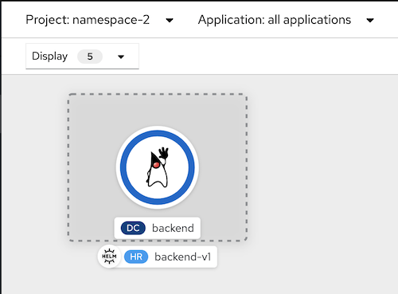

- Helm Chart details

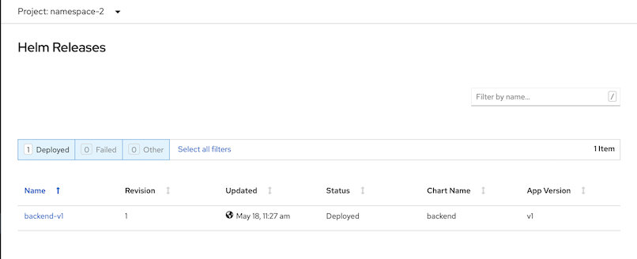

### Verify Installation
- Check pods on namespace-1 and namespace-2
```bash
oc get pods -n namespace-1
#Sample output
NAME                READY   STATUS      RESTARTS   AGE
frontend-1-b2w7p    1/1     Running     0          8m37s
frontend-1-deploy   0/1     Completed   0          8m34s
oc get pods -n namespace-2
#Sample output
NAME               READY   STATUS      RESTARTS   AGE
backend-1-deploy   0/1     Completed   0          5s
backend-1-pdkf9    1/1     Running     0          8s
```

- Check Develor Console for applications's configuration

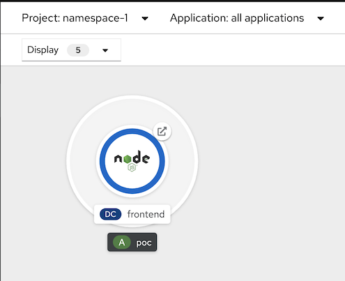

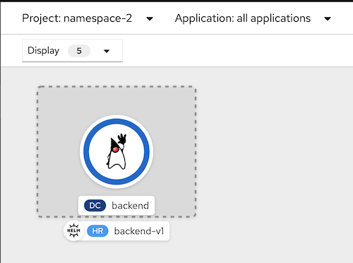
  
## Namespace's Quotas
- Check Namespace's quotas on Project Details on Web Developer Console

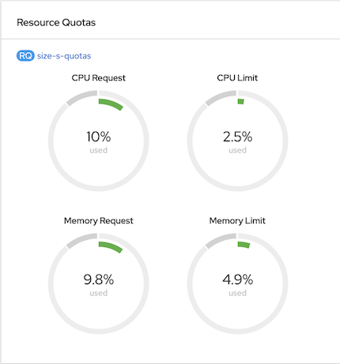

- Drill down to Resource Quota details view

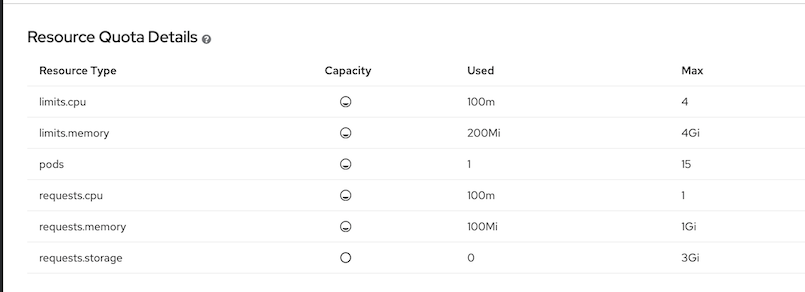

- Scale pod to 8
```bash
oc scale dc/backend --replicas=8 -n namespace-2
#Or use developer console
```
- Check Web Console for namespace-2 resource quotas.

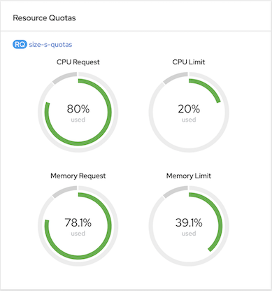

- Create 3 more pods. This will exceeded quota's of request CPU and memory.

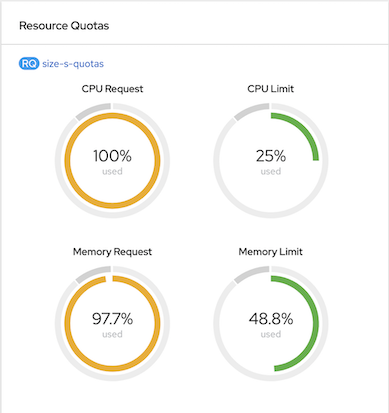

- Check alert in event viewer.

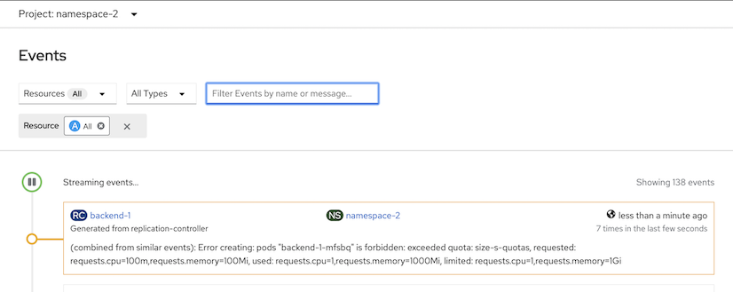
)
- Apply [size M](artifacts/size-m-quotas.yaml) 
```bash
oc apply -f artifacts/size-m-quotas.yaml -n namespace-2
oc delete -f artifacts/size-s-quotas.yaml -n namespace-2
```
- Check Web Console for namespace-2 resource quotas. CPU request will be 50% used.

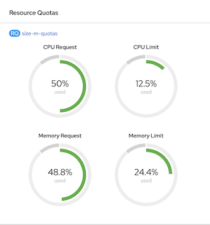

- Scale to 12 pods and check number of backend pods on namespace-2
```bash
oc scale dc/backend --replicas=12 -n namespace-2
oc get pods -n namespace-2 | grep backend | grep Running | wc -l
```

- Reapply [size S](artifacts/size-s-quotas.yaml) and check resource quotas
```bash
oc apply -f artifacts/size-s-quotas.yaml -n namespace-2
oc delete -f artifacts/size-m-quotas.yaml -n namespace-2
```
Utilization

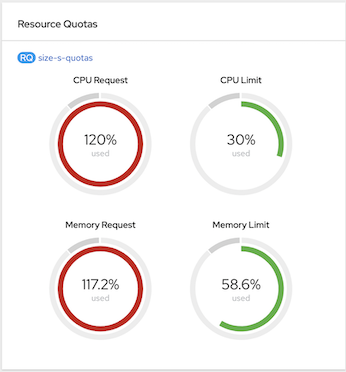

- Scale backend pod to 1 and claim storage for 2 GB
```bash
oc project namespace-2
oc scale dc/backend --replicas=1 -n namespace-2
watch oc get pods
oc set volume dc/backend --add --name=data --type=persistentVolumeClaim --claim-name=data \
--claim-size=2Gi --claim-mode='ReadWriteOnce' --mount-path=/data --containers=backend -n namespace-2
watch oc get pods
```
- Check PVC claim
```bash
oc get pvc -n namespace-2
#Sample Output
NAME   STATUS   VOLUME                                     CAPACITY   ACCESS MODES   STORAGECLASS   AGE
data   Bound    pvc-08d07d60-b240-4b6d-94b1-a2d5df1b9203   2Gi        RWO            gp2            7m17s
```
- Check Web Console for namespace-2 resource quotas.

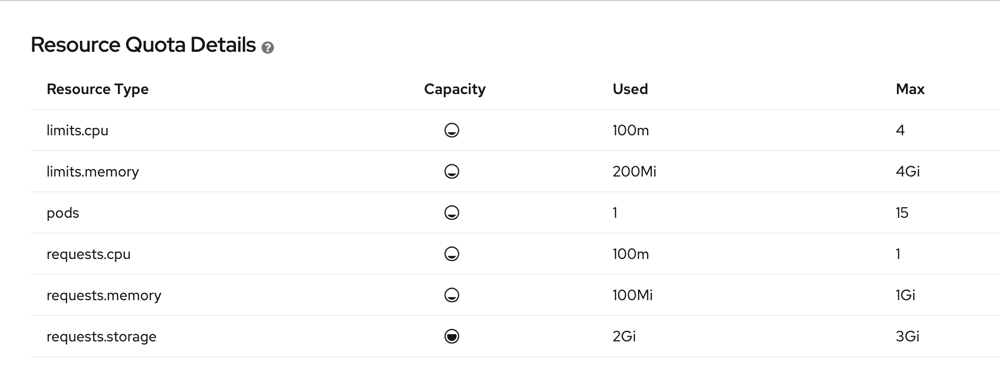

- Create new deployment ([dummy-with-pvc.yaml](artifacts/dummy-with-pvc.yaml)) with 2 GB persistent volume claim
```bash
oc apply -f artifacts/dummy.yaml -n namespace-2
oc set volume dc/dummy --add --name=data --type=persistentVolumeClaim --claim-name=data2 \
--claim-size=2Gi --claim-mode='ReadWriteOnce' --mount-path=/data --containers=dummy -n namespace-2
```
- Persistent volume claim will faied because quota is 3 GB
```bash
error: failed to patch volume update to pod template: persistentvolumeclaims "data2" is forbidden: exceeded quota: size-s-quotas, requested: requests.storage=2Gi, used: requests.storage=2Gi, limited: requests.storage=3Gi
```
- Remove persistent volume claim from backend and delete dummy deployment.
```bash
oc set volume dc/backend --remove --name=data -n namespace-2
oc delete pvc data -n namespace-2
oc delete -f artifacts/dummy.yaml -n namespace-2
```

## Blue/Green Deployment

### Frontend
- deploy [frontend-v2](artifacts/frontend-v2.yaml) on namespace-1
```bash
oc apply -f artifacts/frontend-v2.yaml -n namespace-1
oc expose dc/frontend-v2 -n namespace-1
```
- Run test script to frontend route
```bash
scripts/loop-frontend.sh
```
- Sample output
```log
Loop: 1
Frontend version: v1 => [Backend: http://backend.namespace-2.svc.cluster.local:8080, Response: 200, Body: Backend version:v1, Response:200, Host:backend-1-srrhl, Status:200, Message: Hello, World]
Loop: 2
Frontend version: v1 => [Backend: http://backend.namespace-2.svc.cluster.local:8080, Response: 200, Body: Backend version:v1, Response:200, Host:backend-1-srrhl, Status:200, Message: Hello, World]
Loop: 3
Frontend version: v1 => [Backend: http://backend.namespace-2.svc.cluster.local:8080, Response: 200, Body: Backend version:v1, Response:200, Host:backend-1-srrhl, Status:200, Message: Hello, World]
```
- Blue/Green deployment by configure frontend route to switch to frontend-v2 ( on another terminal)
```bash
scripts/blue-green-deployment.sh
```
- [blue-green-deployment.sh](blue-green-deployment.sh) configure route to point to service frontend-v2
```bash
#Change target service to frontend-v2
oc patch route frontend  -p '{"spec":{"to":{"name":"'frontend-v2'"}}}' -n namespace-1
#Check route configuration
oc describe route rontend -n namespace-1
#Sample output
...
Service:	frontend
Weight:		100 (100%)
Endpoints:	10.130.2.68:8080
```
- Check Result
```log
Loop: 3
Frontend version: v1 => [Backend: http://backend.namespace-2.svc.cluster.local:8080, Response: 200, Body: Backend version:v1, Response:200, Host:backend-1-srrhl, Status:200, Message: Hello, World]
Loop: 4
Frontend version: v2 => [Backend: http://backend.namespace-2.svc.cluster.local:8080, Response: 200, Body: Backend version:v1, Response:200, Host:backend-1-srrhl, Status:200, Message: Hello, World]
Loop: 5
Frontend version: v2 => [Backend: http://backend.namespace-2.svc.cluster.local:8080, Response: 200, Body: Backend version:v1, Response:200, Host:backend-1-srrhl, Status:200, Message: Hello, World]
```
- Switch back to v1
```bash
oc patch route frontend  -p '{"spec":{"to":{"name":"'frontend'"}}}' -n namespace-1
```

### Backend
- deploy [backend-v2](artifacts/backend-v2.yaml) on namespace-2
```bash
oc apply -f artifacts/backend-v2.yaml -n namespace-2
```
- Run test script to frontend route
```bash
scripts/loop-frontend.sh
```
- Sample output
```log
Loop: 1
Frontend version: v1 => [Backend: http://backend.namespace-2.svc.cluster.local:8080, Response: 200, Body: Backend version:v1, Response:200, Host:backend-1-72vtd, Status:200, Message: Hello, World]
Loop: 2
Frontend version: v1 => [Backend: http://backend.namespace-2.svc.cluster.local:8080, Response: 200, Body: Backend version:v1, Response:200, Host:backend-1-72vtd, Status:200, Message: Hello, World]
Loop: 3
Frontend version: v1 => [Backend: http://backend.namespace-2.svc.cluster.local:8080, Response: 200, Body: Backend version:v1, Response:200, Host:backend-1-72vtd, Status:200, Message: Hello, World]
```
- Blue/Green deployment for backend by configure backend service selector to select label version v2
```bash
oc patch service backend  -p '{"spec":{"selector":{"version":"'v2'"}}}' -n namespace-2
#Switch back to v1
oc patch service backend  -p '{"spec":{"selector":{"version":"'v1'"}}}' -n namespace-2
```

- Switch back to v1
```bash
oc patch service backend  -p '{"spec":{"selector":{"version":"'v1'"}}}' -n namespace-2
```
- Remove [backend-v2](artifacts/backend-v2.yaml) 
```bash
oc delete -f artifacts/backend-v2.yaml -n namespace-2
```

## Horizontal Pod Autoscalers (HPA)

### by CPU
- Set HPA for frontend app based on CPU utilization.
```bash
oc autoscale dc/frontend --min 1 --max 3 --cpu-percent=7 -n namespace-1
```
- Check HPA status and load test
```bash
watch oc get hpa -n namespace-1
#Run load test on another terminal
siege -c 50 https://$(oc get route frontend -o jsonpath='{.spec.host}' -n namespace-1)
oc describe PodMetrics frontend-1-9kcjq  -n namespace-1
```

### by memory
- Set HPA for backend based on memory utilization
```bash
oc apply -f artifacts/backend-memory-hpa.yaml -n namespace-2
```
- Check HPA status and load test
```bash
watch oc get hpa -n namespace-2
#Run load test on another terminal
siege -c 50 https://$(oc get route frontend -o jsonpath='{.spec.host}' -n namespace-1)
oc describe
```

<!-- ### by custom metrics -->


## East-West Security

### Network Policy
- Frontend App in namespace namespace-1 accept only request from OpenShift's router in namespace openshift-ingress by apply policy [deny all](artifacts/network-policy-deny-from-all.yaml) and [accept from ingress](artifacts/network-policy-allow-network-policy-global.yaml)
```bash
# Consider edit default project template to start with deny all
oc apply -f artifacts/network-policy-deny-from-all.yaml -n namespace-1
oc apply -f artifacts/network-policy-allow-network-policy-global.yaml -n namespace-1
```
- Backend App in namespace namespace-1 accept only request from namespace-1 and must contains label app=frontend by apply policy [deny all](artifacts/network-policy-deny-from-all.yaml) and [allow ingress from namespace-1](artifacts/network-policy-allow-from-namespace-1.yaml)
```
oc apply -f artifacts/network-policy-deny-from-all.yaml -n namespace-2
oc apply -f artifacts/network-policy-allow-from-namespace-1.yaml -n namespace-2
```

## North-South Security and control

### Ingress
- For ingress traffic, IP whitelist can be set to each route.
```bash
oc annotate route frontend haproxy.router.openshift.io/ip_whitelist=13.52.0.0/16 -n namespace-1
```
- For ingress traffic, set rate limits for http protocol to 5. Each router will limit request for each IP for 5 request/sec (Our environment has 2 routers then total limit is 10 requests)
```bash
oc annotate route frontend haproxy.router.openshift.io/rate-limit-connections=true -n namespace-1
oc annotate route frontend haproxy.router.openshift.io/rate-limit-connections.rate-http=5 -n namespace-1
```
- For egress traffic, set [egress firewall](artifacts/egress-namespace-2.yaml) to allow only specific destination. 
```bash
oc login --insecure-skip-tls-verify=true --server=$OCP --username=opentlc-mgr
oc apply -f artifacts/egress-namespace-2.yaml -n namespace-2
```

## Log & Metrics Monitoring

### Operation and Application Log
- WIP

### Cluster Metrics and Utilization

#### Deloper Console
- Overall Namespace Utilization

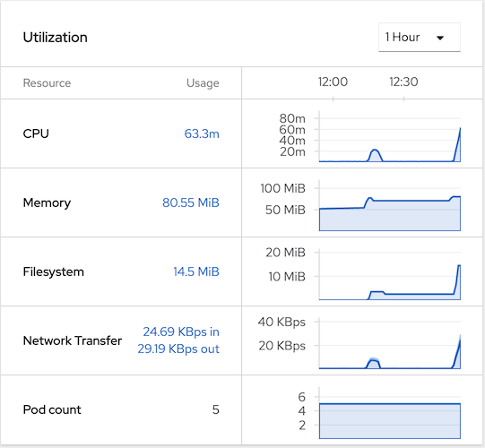

- Namespace Monitoring

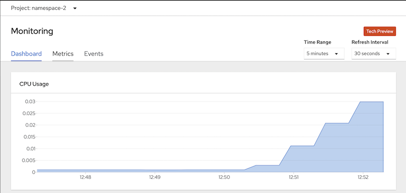

- Namespace Events

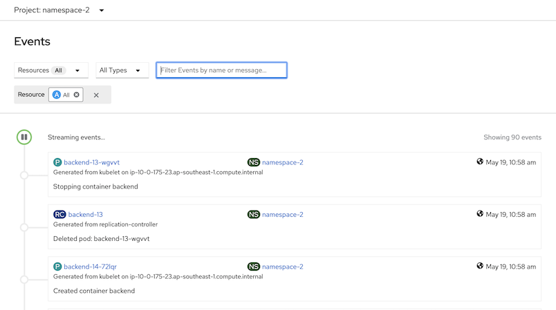

### Applications Metrics
- Create namespace for Prometheus and Grafana
```bash
oc login --insecure-skip-tls-verify=true --server=$OCP --username=opentlc-mgr
oc new-project user1-app-monitor --display-name="User1 - application monitor"
oc label namespace user1-app-monitor role=app-monitor
```
- Set network policy for namespace-2 to allow traffic from user1-app-monitor
```bash
oc apply -f artifacts/network-policy-allow-from-app-monitor.yaml -n namespace-2
```
- Setup Promethues in namespace user1-app-monitor by crete CRD resources
```bash
#Service Account steps need cluster admin roles.
oc login --insecure-skip-tls-verify=true --server=$OCP --username=opentlc-mgr
oc apply -f artifacts/prometheus-service-account.yaml -n user1-app-monitor
oc login --insecure-skip-tls-verify=true --server=$OCP --username=usr1
oc apply -f artifacts/prometheus-service-monitor.yaml -n user1-app-monitor
oc apply -f artifacts/prometheus.yaml -n user1-app-monitor
oc create route edge prometheus --service=prometheus --port=9090 -n user1-app-monitor
echo "https://$(oc get route prometheus -n user1-app-monitor -o jsonpath='{.spec.host}')"
```
- Setup Grafana in namespace user1-app-monitor by crete CRD resources
```bash
oc apply -f artifacts/grafana_datasource.yaml -n user1-app-monitor
oc apply -f artifacts/grafana.yaml -n user1-app-monitor
oc apply -f artifacts/grafana_dashboard.yaml -n user1-app-monitor
echo "https://$(oc get route grafana-route -n user1-app-monitor -o jsonpath='{.spec.host}')"
```
- Check Prometheus and Granfana on Developer Console

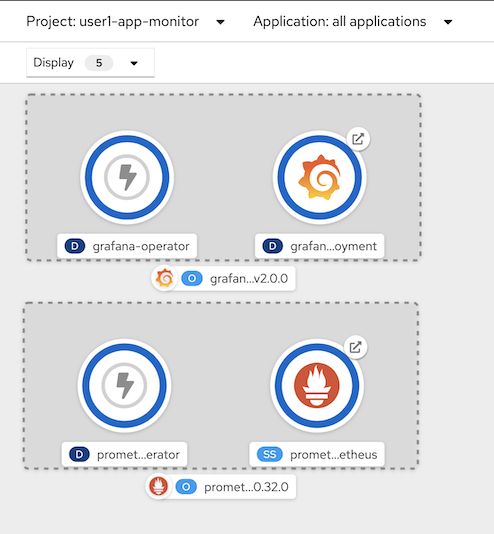

- Check prometheus console for Target and test query

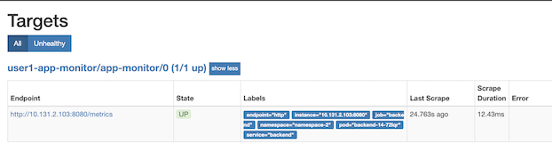

- Grafana Dashboard

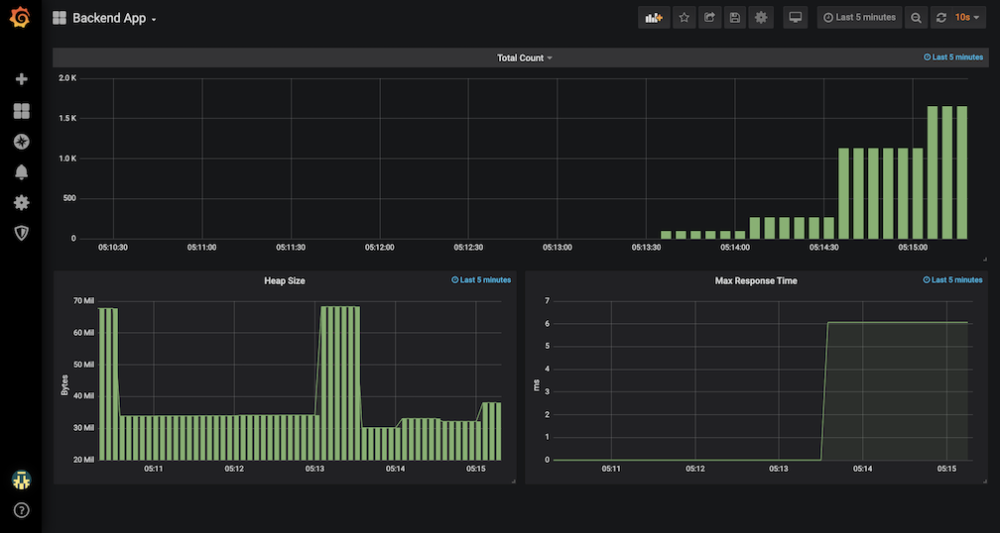

## Service Mesh

### Control Plane
- Create namespace for control plane
```bash
oc login --insecure-skip-tls-verify=true --server=$OCP --username=opentlc-mgr
oc new-project user1-istio-system --display-name="Service Mesh Control Plane for user1"
oc label namespace user1-istio-system network-policy=istio-system
oc policy add-role-to-user edit user1 -n user1-istio-system
# operator automatic crate network policy - double check again!
# oc apply -f artifacts/network-poliy-allow-from-istio-system.yaml -n namespace-1
# oc apply -f artifacts/network-poliy-allow-from-istio-system.yaml -n namespace-2
```
- Create control plane and join namespace-1 and namespace-2 to control plane
```bash
oc login --insecure-skip-tls-verify=true --server=$OCP --username=user1
oc apply -f artifacts/service-mesh-basic-install.yaml -n user1-istio-system
oc apply -f artifacts/service-mesh-memberroll.yaml -n user1-istio-system
```
- Inject sidecar by annotate sidecar.istio.io/inject to deployment config template.
```bash
oc patch dc frontend -p '{"spec":{"template":{"metadata":{"annotations":{"sidecar.istio.io/inject":"true"}}}}}' -n namespace-1
oc patch dc backend -p '{"spec":{"template":{"metadata":{"annotations":{"sidecar.istio.io/inject":"true"}}}}}' -n namespace-2
```

### Observability with Kiali and Jaeger
- Run load test tool
```bash
siege -c 5 https://$(oc get route frontend -o jsonpath='{.spec.host}' -n namespace-1)
```
- Kiali graph displays application topology
  
  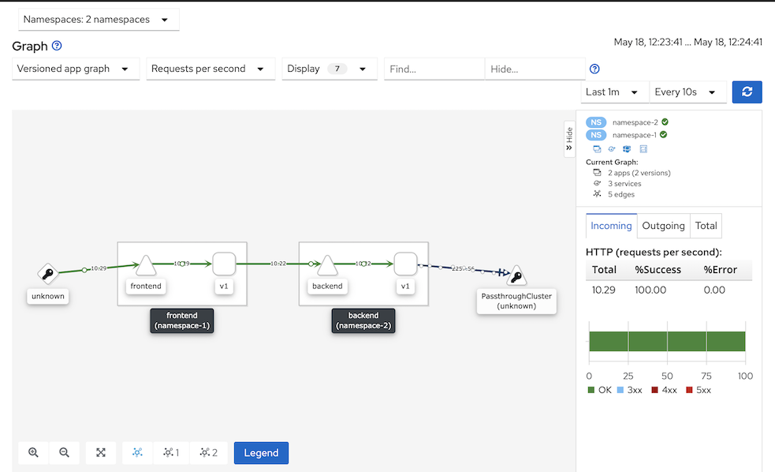

- Jaeger trasaction tracing
  
  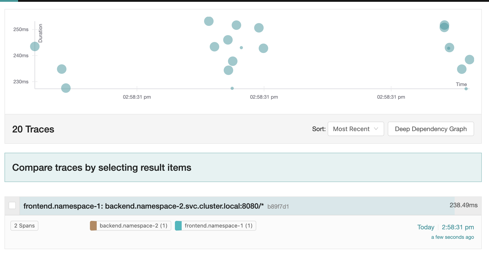

### Secure Backend by mTLS
- Enable mTLS for backend by create destination rule and virtual service.
```bash
oc patch dc frontend -p '{"spec":{"template":{"metadata":{"annotations":{"sidecar.istio.io/rewriteAppHTTPProbers":"true"}}}}}' -n namespace-1
oc patch dc backend -p '{"spec":{"template":{"metadata":{"annotations":{"sidecar.istio.io/rewriteAppHTTPProbers":"true"}}}}}' -n namespace-2
oc apply -f artifacts/backend-destination-rule.yaml -n namespace-2
oc apply -f artifacts/backend-virtual-service.yaml -n namespace-2
oc apply -f artifacts/backend-authenticate-mtls.yaml -n namespace-2
```
- Create [dummy pod](artifacts/dummy.yaml) (without sidecar) on namespace-1 
```bash
oc apply -f artifacts/dummy.yaml -n namespace-1
```
- Connect ot dummy pod terminal and cURL to backend service
```bash
sh-4.4$ curl http://backend.namespace-2.svc.cluster.local:8080
curl: (56) Recv failure: Connection reset by peer
```
- Connect to frontend pod terminal and cURL to backend service.
- cURL to frontend's route to verify that route still working properly.

### Secure frontend by JWT
- Create [destination rule](artifacts/frontend-destination-rule.yaml), [gateway](artifacts/frontend-gateway.yaml) and [virtual service](artifacts/frontend-virtual-service.yaml) for frontend
```bash
oc apply -f artifacts/frontend-destination-rule.yaml -n namespace-1
oc apply -f artifacts/frontend-gateway.yaml -n namespace-1
oc apply -f artifacts/frontend-virtual-service.yaml -n namespace-1
echo "Istio Gateway URL=> https://$(oc get route istio-ingressgateway -o jsonpath='{.spec.host}' -n user1-istio-system)"
```
- Enable [JWT authorization](artifacts/frontend-jwt-with-mtls.yaml) for frontend
```bash
oc apply -f artifacts/frontend-jwt-with-mtls.yaml -n namespace-1
```
- Check generated token with [jwt.io](https://jwt.io)
- Test without JWT token, wrong JWT token and valid JWT token
```bash
curl -v http://$(oc get route istio-ingressgateway -o jsonpath='{.spec.host}' -n user1-istio-system)
#401 Unauthorized
#Origin authentication failed
curl -v -H "Authorization: Bearer $(cat artifacts/jwt-wrong-realms.txt)" http://$(oc get route istio-ingressgateway -o jsonpath='{.spec.host}' -n user1-istio-system)
#401 Unauthorized
#Origin authentication failed
curl -v -H "Authorization: Bearer $(cat artifacts/token.txt)" http://$(oc get route istio-ingressgateway -o jsonpath='{.spec.host}' -n user1-istio-system)
#Success
```

### Service Mesh Egress Policy
- Remove egress firewall
```bash
oc login --insecure-skip-tls-verify=true --server=$OCP --username=opentlc-mgr
oc delete -f artifacts/egress-namespace-2.yaml -n namespace-2
```
- Set control plane configuration to disallow egress traffic by default
```bash
 oc get configmap istio -n user1-istio-system -o yaml \
  | sed 's/mode: ALLOW_ANY/mode: REGISTRY_ONLY/g' \
  | oc replace -n user1-istio-system -f -
```
- Create [egerss service entry](artifacts/egress-serviceentry.yml) to allow https request to httpbin.org
```bash
oc apply -f artifacts/egress-serviceentry.yml -n user1-istio-system
```
- Check kiali graph

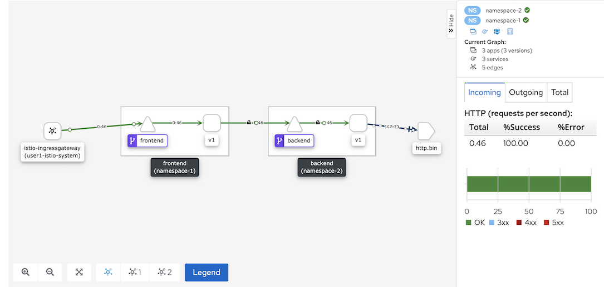
