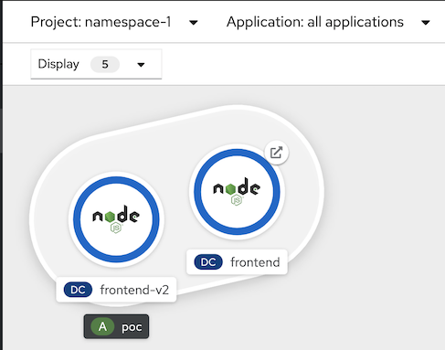

# Deployment Strategy
<!-- TOC -->

- [Deployment Strategy](#deployment-strategy)
  - [Blue/Green deployment with OpenShift's Route](#bluegreen-deployment-with-openshifts-route)
  - [Canary deployment with OpenShift's Route](#canary-deployment-with-openshifts-route)
  - [Blue/Green deployment with Service](#bluegreen-deployment-with-service)

<!-- /TOC -->

## Blue/Green deployment with OpenShift's Route
- deploy [frontend-v2](artifacts/frontend-v2.yaml) on namespace-1
```bash
oc apply -f artifacts/frontend-v2.yaml -n namespace-1
oc expose dc/frontend-v2 -n namespace-1
oc project namespace-1
watch oc get pods
```
- Check Developer Console



- Run test script to frontend route
```bash
scripts/loop-frontend.sh
```
- Sample output
```log
Loop: 1
Frontend version: v1 => [Backend: http://backend.namespace-2.svc.cluster.local:8080, Response: 200, Body: Backend version:v1, Response:200, Host:backend-1-srrhl, Status:200, Message: Hello, World]
Loop: 2
Frontend version: v1 => [Backend: http://backend.namespace-2.svc.cluster.local:8080, Response: 200, Body: Backend version:v1, Response:200, Host:backend-1-srrhl, Status:200, Message: Hello, World]
Loop: 3
Frontend version: v1 => [Backend: http://backend.namespace-2.svc.cluster.local:8080, Response: 200, Body: Backend version:v1, Response:200, Host:backend-1-srrhl, Status:200, Message: Hello, World]
```
- Blue/Green deployment by configure frontend route to switch to frontend-v2 ( on another terminal)
```bash
scripts/blue-green-deployment.sh
```
- [blue-green-deployment.sh](blue-green-deployment.sh) configure route to point to service frontend-v2
```bash
#Change target service to frontend-v2
oc patch route frontend  -p '{"spec":{"to":{"name":"'frontend-v2'"}}}' -n namespace-1
#Check route configuration
oc describe route rontend -n namespace-1
#Sample output
...
Service:	frontend
Weight:		100 (100%)
```

<!-- Check Developer Console that route is point to frontend-v2

 -->

- Check Result
```log
Loop: 3
Frontend version: v1 => [Backend: http://backend.namespace-2.svc.cluster.local:8080, Response: 200, Body: Backend version:v1, Response:200, Host:backend-1-srrhl, Status:200, Message: Hello, World]
Loop: 4
Frontend version: v2 => [Backend: http://backend.namespace-2.svc.cluster.local:8080, Response: 200, Body: Backend version:v1, Response:200, Host:backend-1-srrhl, Status:200, Message: Hello, World]
Loop: 5
Frontend version: v2 => [Backend: http://backend.namespace-2.svc.cluster.local:8080, Response: 200, Body: Backend version:v1, Response:200, Host:backend-1-srrhl, Status:200, Message: Hello, World]
```
- Switch back to v1
```bash
oc patch route frontend  -p '{"spec":{"to":{"name":"'frontend'"}}}' -n namespace-1
```

## Canary deployment with OpenShift's Route
- Canary deployment with 80% of request to v1 and 20% to v2 with [frontend-route-canary-80-20.yaml](artifacts/frontend-route-canary-80-20.yaml)
```bash
oc apply -f artifacts/frontend-route-canary-80-20.yaml -n namespace-1
```
- Test canary deployment with [frontend-loop-10.sh](scripts/loop-frontend-10.sh)
```bash
scripts/loop-frontend-10.sh
#Output
Frontend: v1
Frontend: v1
Frontend: v1
Frontend: v1
Frontend: v2
Frontend: v1
Frontend: v1
Frontend: v1
Frontend: v1
Frontend: v2
========================================================
Version v1: 8
Version v2: 2
========================================================
```
- Adjust weight to 70/30 with [frontend-route-canary-70-30.yaml](artifacts/frontend-route-canary-70-30.yaml)
```bash
oc apply -f artifacts/frontend-route-canary-70-30.yaml -n namespace-1
#Output
Frontend: v1
Frontend: v1
Frontend: v1
Frontend: v2
Frontend: v1
Frontend: v1
Frontend: v2
Frontend: v1
Frontend: v1
Frontend: v2
========================================================
Version v1: 7
Version v2: 3
========================================================
```
- Remove frontend-v2 and configure route to v1 only
```bash
oc apply -f artifacts/frontend-route.yaml -n namespace-1
oc delete dc/frontend-v2;oc delete svc/frontend-v2
```

## Blue/Green deployment with Service

- deploy [backend-v2](artifacts/backend-v2.yaml) on namespace-2
```bash
oc apply -f artifacts/backend-v2.yaml -n namespace-2
```
- Run test script to frontend route
```bash
scripts/loop-frontend.sh
```
- Sample output
```log
Loop: 1
Frontend version: v1 => [Backend: http://backend.namespace-2.svc.cluster.local:8080, Response: 200, Body: Backend version:v1, Response:200, Host:backend-1-72vtd, Status:200, Message: Hello, World]
Loop: 2
Frontend version: v1 => [Backend: http://backend.namespace-2.svc.cluster.local:8080, Response: 200, Body: Backend version:v1, Response:200, Host:backend-1-72vtd, Status:200, Message: Hello, World]
Loop: 3
Frontend version: v1 => [Backend: http://backend.namespace-2.svc.cluster.local:8080, Response: 200, Body: Backend version:v1, Response:200, Host:backend-1-72vtd, Status:200, Message: Hello, World]
```
- Blue/Green deployment for backend by configure backend service selector to select label version v2
```bash
oc patch service backend  -p '{"spec":{"selector":{"version":"'v2'"}}}' -n namespace-2
```
- Check output on anther terminal that backend is witch to v2
- Switch back to v1
```bash
oc patch service backend  -p '{"spec":{"selector":{"version":"'v1'"}}}' -n namespace-2
```
- Remove [backend-v2](artifacts/backend-v2.yaml) 
```bash
oc delete -f artifacts/backend-v2.yaml -n namespace-2
```

<!-- #### Canary deployment
Canary deployment for service is supported by Serverless or Service Mesh. Following steps demonstrate for Serverless

- Deploy backend with Serverless
```bash
kn service create backend --namespace namespace-2 --revision-name=backend-v1 --image quay.io/voravitl/backend-native:v1
```
- Test
```bash

``` -->


