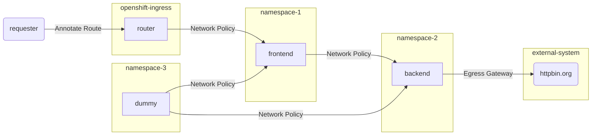

# Traffic Control and Security
<!-- TOC -->

- [Traffic Control and Security](#traffic-control-and-security)
  - [Network Policy (East-West Security)](#network-policy-east-west-security)
    - [Project: namespace-1](#project-namespace-1)
    - [Project: namespace-2](#project-namespace-2)
  - [Ingress and Egress Control (North-South)](#ingress-and-egress-control-north-south)
    - [Ingress Traffic](#ingress-traffic)
    - [Egress Traffic](#egress-traffic)

<!-- /TOC -->




## Network Policy (East-West Security)

### Project: namespace-1

Frontend App in namespace namespace-1 accept only request from OpenShift's router in namespace openshift-ingress by apply policy [deny all](artifacts/network-policy-deny-from-all.yaml) and [accept from ingress](artifacts/network-policy-allow-network-policy-global.yaml)

- Default network policy
```bash
oc get networkpolicy -n namespace-1
#Output
NAME                           POD-SELECTOR   AGE
allow-from-all-namespaces      <none>         152m
allow-from-ingress-namespace   <none>         152m
```
- Remove allow-from-all-namespaces from namespace-1
```bash
oc delete networkpolicy/allow-from-ingress-namespace -n namespace-1
```
<!-- - Apply network policy to default with [network-policy-deny-from-all.yaml](artifacts/network-policy-deny-from-all.yaml)
```bash
oc apply -f artifacts/network-policy-deny-from-all.yaml -n namespace-1
oc apply -f artifacts/allow-network-policy-global.yaml -n namespace-1
```
- Sample of apply network policy by RESTful API
```bash
TOKEN=$(oc whoami -t)
curl --verbose --insecure --location --request POST ${OCP}'/apis/networking.k8s.io/v1/namespaces/namespace-1/networkpolicies' \
--header 'Accept: application/json' \
--header 'Content-Type: application/json' \
--header 'Authorization: Bearer '${TOKEN} \
--data-raw '{
    "apiVersion": "networking.k8s.io/v1",
    "kind": "NetworkPolicy",
    "metadata": {
        "name": "deny-from-all"    },
    "spec": {
        "podSelector": {},
        "policyTypes": [
            "Ingress"
        ]
    }
}'
curl --verbose --insecure --location --request POST ${OCP}'/apis/networking.k8s.io/v1/namespaces/namespace-1/networkpolicies' \
--header 'Accept: application/json' \
--header 'Content-Type: application/json' \
--header 'Authorization: Bearer '${TOKEN} \
--data-raw '{
  "apiVersion": "networking.k8s.io/v1",
  "kind": "NetworkPolicy",
  "metadata": {
    "name": "allow-network-policy-global"
  },
  "spec": {
    "podSelector": {},
    "ingress": [
      {
        "from": [
          {
            "namespaceSelector": {
              "matchLabels": {
                "network-policy": "global"
              }
            }
          }
        ]
      }
    ],
    "policyTypes": [
      "Ingress"
    ]
  }
}' -->
- Check network policy on namespace-1
```bash
oc get networkpolicy -n namespace-1

# Output
NAME                          POD-SELECTOR   AGE
allow-network-policy-global   <none>         8s
```
- Check that route still work properly
```bash
curl -v $FRONTEND_URL/version
```
- Pod in namespace-1 can connect ot service in namespace-1
```bash
oc exec $(oc get pods -n namespace-1 | grep Running | head -n 1 | awk '{print $1}') -n namespace-1 -- curl http://frontend.namespace-1.svc.cluster.local:8080/version

# Output
Frontend version:v1, Response:200, Meessage:check version
```
- Pod in namespace-2 cannot connect to pod on namespace-1
```bash
oc exec $(oc get pods -n namespace-2 | grep Running | head -n 1 | awk '{print $1}') -n namespace-2 -- curl http://frontend.namespace-1.svc.cluster.local:8080/version

# Output
Connection timed out command terminated with exit code 7
```

### Project: namespace-2

Backend App in namespace namespace-2 accept only request from namespace-1 and pods must contains label app=frontend remove default allow-from-all-namespaces.

- Configure network policies for namespace-2
```bash
oc delete networkpolicy/allow-from-all-namespaces -n namespace-2
oc apply -f artifacts/network-policy-allow-from-namespace-1.yaml -n namespace-2
```
- Check network policy
```bash
oc get networkpolicy -n namespace-2

# Output
NAME                           POD-SELECTOR   AGE
allow-from-ingress-namespace   <none>         27m
allow-from-namespace-1         app=backend    5s
```

- Pod in namespace-1 can connect to pod on namespace-2
```bash
oc exec $(oc get pods -n namespace-1 | grep Running | head -n 1 | awk '{print $1}') -n namespace-1 -- curl http://backend.namespace-2.svc.cluster.local:8080/version
```
- Check that route still work properly.
```bash
curl -v $FRONTEND_URL
```
- Expose route for backend service
```
oc expose svc/backend -n namespace-2
BACKEND_URL=http://$(oc get route backend -n namespace-2 -o jsonpath='{.spec.host}')
curl -v ${BACKEND_URL}/version
```
- Project namespace-2 is used for backend service only. Then remove allow-from-ingress-namespace and test backend's route again.
```bash
oc delete networkpolicy/allow-from-ingress-namespace -n namespace-2
curl -v ${BACKEND_URL}/version
```
- Delete backend's route
```bash
oc delete route/backend -n namespace-2
```

## Ingress and Egress Control (North-South)

### Ingress Traffic
- For ingress traffic, set rate limits for http protocol to 5 for each IP
```bash
oc annotate route frontend haproxy.router.openshift.io/rate-limit-connections=true -n namespace-1
oc annotate route frontend haproxy.router.openshift.io/rate-limit-connections.rate-http=5 -n namespace-1
```
- Test with [loop-frontend.sh](scripts/loop-frontend.sh)
```bash
...
Loop: 4
Frontend version: v1 => [Backend: http://backend.namespace-2.svc.cluster.local:8080, Response: 200, Body: Backend version:v1, Response:200, Host:backend-1-6gzdw, Status:200, Message: Hello, World]
Loop: 5
Frontend version: v1 => [Backend: http://backend.namespace-2.svc.cluster.local:8080, Response: 200, Body: Backend version:v1, Response:200, Host:backend-1-6gzdw, Status:200, Message: Hello, World]
Loop: 6
curl: (52) Empty reply from server
...
```
- For ingress traffic, IP whitelist can be set to each route.
```bash
oc annotate route frontend haproxy.router.openshift.io/ip_whitelist=13.52.0.0/16 -n namespace-1
```
- Test with cURL
```bash
curl $FRONTEND_URL

# Output
curl: (52) Empty reply from server
```
- Annotate route with test's IP address
```bash
oc annotate route frontend haproxy.router.openshift.io/ip_whitelist=$(curl http://ident.me) --overwrite -n namespace-1
```
- Test with cURL again and remove IP whitelist
```bash
curl $FRONTEND_URL
oc annotate route frontend haproxy.router.openshift.io/ip_whitelist= --overwrite -n namespace-1
```
### Egress Traffic
- Configure egress filrewall to allow only destination is facebook.com
```bash
oc login --insecure-skip-tls-verify=true --server=$OCP --username=opentlc-mgr
oc apply -f artifacts/egress-namespace-2-facebook.yaml -n namespace-2
curl $FRONTEND_URL

# Output
<html><body><h1>504 Gateway Time-out</h1>
The server didn't respond in time.
</body></html>
```
- For egress traffic, set [egress firewall](artifacts/egress-namespace-2.yaml) to allow only [httpbin.org](https://httpbin.org)
```bash
oc delete egressnetworkpolicy/egress-namespace-2 -n namespace-2
oc apply -f artifacts/egress-namespace-2.yaml -n namespace-2
curl $FRONTEND_URL
```
- Remove egress 
```bash
oc delete egressnetworkpolicy/egress-namespace-2 -n namespace-2
```
