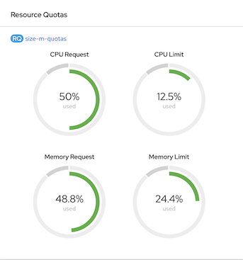

# Application Deployment
<!-- TOC -->

- [Application Deployment](#application-deployment)
  - [Deploy user2 app](#deploy-user2-app)
  - [Deploy Frontend app](#deploy-frontend-app)
  - [Verify Installation](#verify-installation)
  - [Test Namespace's Quotas](#test-namespaces-quotas)

<!-- /TOC -->

Application Architecture
**WIP**

## Deploy user2 app
- Deploy dummy app by deployment config YAML file
```bash
oc login --insecure-skip-tls-verify=true --server=$OCP --username=user2
oc apply -f artifacts/dummy.yaml -n namespace-3
oc get pods -n namespace-3
```

## Deploy Frontend app
- Deploy frontend app with [frontend.yaml](artifacts/frontend.yaml) and [frontend-service.yaml](artifacts/frontend-service.yaml)
```bash
oc login --insecure-skip-tls-verify=true --server=$OCP --username=user1
oc apply -f artifacts/frontend.yaml -n namespace-1
oc apply -f artifacts/frontend-service.yaml -n namespace-1
oc create route edge frontend --service=frontend --port=8080 -n namespace-1
oc project namespace-1
watch oc get pods
echo "Front End URL=> https://$(oc get route frontend -o jsonpath='{.spec.host}' -n namespace-1)"
export FRONTEND_URL=https://$(oc get route frontend -o jsonpath='{.spec.host}' -n namespace-1)
```

<!-- - Deploy backend app
```bash
oc login --insecure-skip-tls-verify=true --server=$OCP --username=user1
oc apply -f artifacts/backend.yaml -n namespace-2
oc apply -f artifacts/backend-service.yaml -n namespace-2
echo "Backend Internal End URL=> http://$(oc get svc backend  -o jsonpath='{.spec.ports[0].port}'  -n namespace-2)" 
```-->

## Deploy Backend app with Helm Chart
- Deploy backend app using helm chart => [backend-chart](backend-chart)
- Test with dry run 
```bash
oc project -n namespace-2
helm install --dry-run test ./backend-chart
```
- Install chart
```bash
oc project -n namespace-2
helm install backend-v1 ./backend-chart
#Sample Output
NAME: backend-v1
LAST DEPLOYED: Mon May 18 10:33:26 2020
NAMESPACE: namespace-2
STATUS: deployed
REVISION: 1
TEST SUITE: None
NOTES:
1. Get the application URL by running these commands:
http://backend:8080
```
- Check Helm Chart in Developer Console Topology view


- Helm Chart details


## Verify Installation
- Check pods on namespace-1 and namespace-2
```bash
oc get pods -n namespace-1
#Sample output
NAME                READY   STATUS      RESTARTS   AGE
frontend-1-b2w7p    1/1     Running     0          8m37s
frontend-1-deploy   0/1     Completed   0          8m34s
oc get pods -n namespace-2
#Sample output
NAME               READY   STATUS      RESTARTS   AGE
backend-1-deploy   0/1     Completed   0          5s
backend-1-pdkf9    1/1     Running     0          8s
```

- Check Develor Console for applications's configuration


  
## Test Namespace's Quotas
- Check Namespace's quotas on Project Details on Web Developer Console


- Drill down to Resource Quota details view


- Scale pod to 8
```bash
oc scale dc/backend --replicas=8 -n namespace-2
#Or use developer console
```
- Check Web Console for namespace-2 resource quotas.


- Create 3 more pods. This will exceeded quota's of request CPU and memory.


- Check alert in event viewer.


)
- Apply [size M](artifacts/size-m-quotas.yaml) 
```bash
oc login --insecure-skip-tls-verify=true --server=$OCP --username=opentlc-mgr
oc apply -f artifacts/size-m-quotas.yaml -n namespace-2
oc delete -f artifacts/size-s-quotas.yaml -n namespace-2
```
- Check Web Console for namespace-2 resource quotas. CPU request will be 50% used.



- Scale to 12 pods and check number of backend pods on namespace-2
```bash
oc scale dc/backend --replicas=12 -n namespace-2
oc get pods -n namespace-2 | grep backend | grep Running | wc -l
```

- Reapply [size S](artifacts/size-s-quotas.yaml) and check resource quotas
```bash
oc apply -f artifacts/size-s-quotas.yaml -n namespace-2
oc delete -f artifacts/size-m-quotas.yaml -n namespace-2
```

Check resources utilization


- Scale backend pod to 1 and claim storage for 2 GB
```bash
oc project namespace-2
oc scale dc/backend --replicas=1 -n namespace-2
watch oc get pods
oc set volume dc/backend --add --name=data --type=persistentVolumeClaim --claim-name=data \
--claim-size=2Gi --claim-mode='ReadWriteOnce' --mount-path=/data --containers=backend -n namespace-2
watch oc get pods
```
- Check PVC claim
```bash
oc get pvc -n namespace-2
#Sample Output
NAME   STATUS   VOLUME                                     CAPACITY   ACCESS MODES   STORAGECLASS   AGE
data   Bound    pvc-08d07d60-b240-4b6d-94b1-a2d5df1b9203   2Gi        RWO            gp2            7m17s
```
- Check mounted file system pod
```bash
oc exec $(oc get pods -n namespace-2 | grep backend | grep Running | head -n 1 | awk '{print $1}') -- df -m
#Sample Output
Filesystem                           1M-blocks  Used Available Use% Mounted on
overlay                                 122341 15081    107261  13% /
tmpfs                                       64     0        64   0% /dev
tmpfs                                    31474     0     31474   0% /sys/fs/cgroup
shm                                         64     1        64   1% /dev/shm
tmpfs                                    31474     6     31468   1% /etc/passwd
/dev/nvme2n1                              1952     6      1930   1% /data
/dev/mapper/coreos-luks-root-nocrypt    122341 15081    107261  13% /etc/hosts
tmpfs                                    31474     1     31474   1% /run/secrets/kubernetes.io/serviceaccount
tmpfs                                    31474     0     31474   0% /proc/acpi
tmpfs                                    31474     0     31474   0% /proc/scsi
tmpfs                                    31474     0     31474   0% /sys/firmware
```
- Check Web Console for namespace-2 resource quotas.


- Create new deployment ([dummy-with-pvc.yaml](artifacts/dummy-with-pvc.yaml)) with 2 GB persistent volume claim
```bash
oc apply -f artifacts/dummy.yaml -n namespace-2
oc set volume dc/dummy --add --name=data --type=persistentVolumeClaim --claim-name=data2 \
--claim-size=2Gi --claim-mode='ReadWriteOnce' --mount-path=/data --containers=dummy -n namespace-2
```
- Persistent volume claim will faied because quota is 3 GB
```bash
error: failed to patch volume update to pod template: persistentvolumeclaims "data2" is forbidden: exceeded quota: size-s-quotas, requested: requests.storage=2Gi, used: requests.storage=2Gi, limited: requests.storage=3Gi
```
- Remove persistent volume claim from backend and delete dummy deployment.
```bash
oc set volume dc/backend --remove --name=data -n namespace-2
oc delete pvc data -n namespace-2
oc delete -f artifacts/dummy.yaml -n namespace-2
```
