# Monitoring Tools
<!-- TOC -->

- [Monitoring Tools](#monitoring-tools)
  - [Developer Console](#developer-console)
  - [Monitoring Dashboard](#monitoring-dashboard)
  - [Operation and Application Log](#operation-and-application-log)
  - [Applications Metrics](#applications-metrics)

<!-- /TOC -->

## Developer Console

Users can use developer console to monitor metrics data from Prometheus, view graph with builtin Grafana and Events with alert manager.

- Overall Namespace Utilization

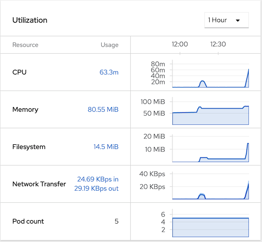

- Namespace Monitoring

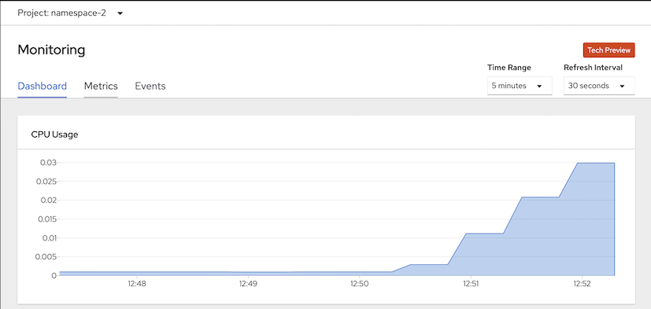

- Metrics Data


- Namespace Events

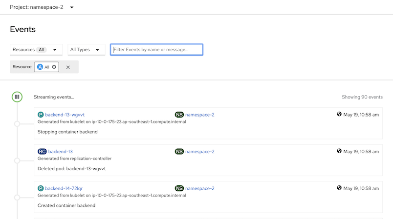

## Monitoring Dashboard

Monitoring dashboard for Administrator and Operator

- Compute resources by Cluster

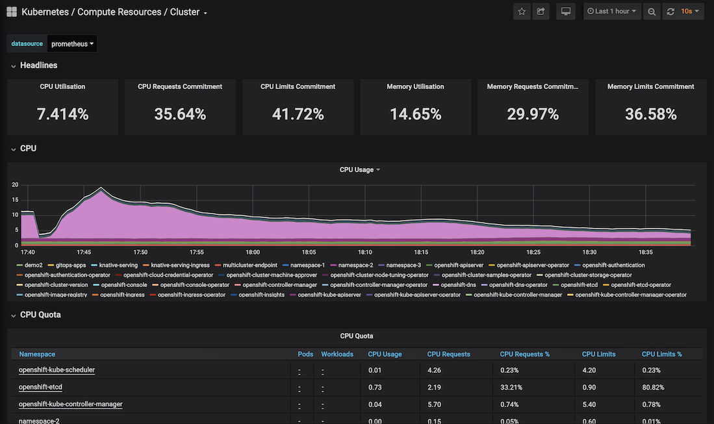


- Compute resources by Node

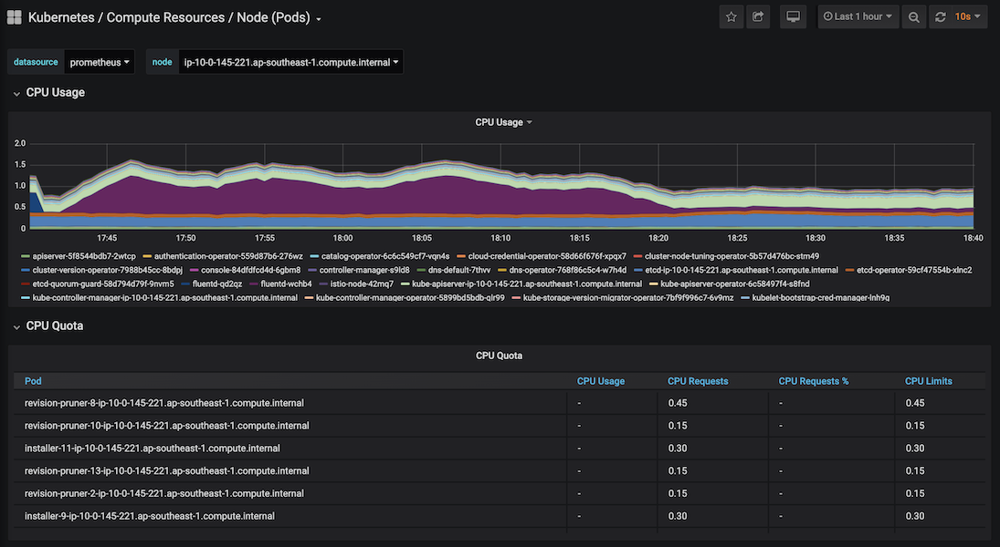

## Operation and Application Log

OpenShift builtin with EFK stack. Kibana will use RBAC from OpenShift then each user will access only their namespace.

- Login to Kibana with user1

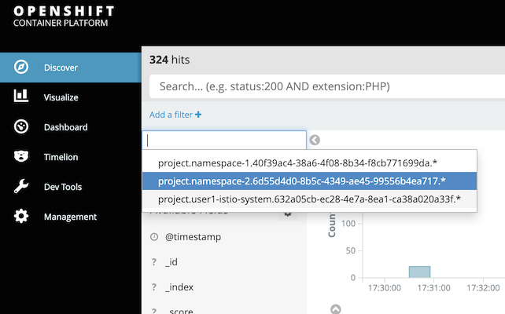

- Overall log

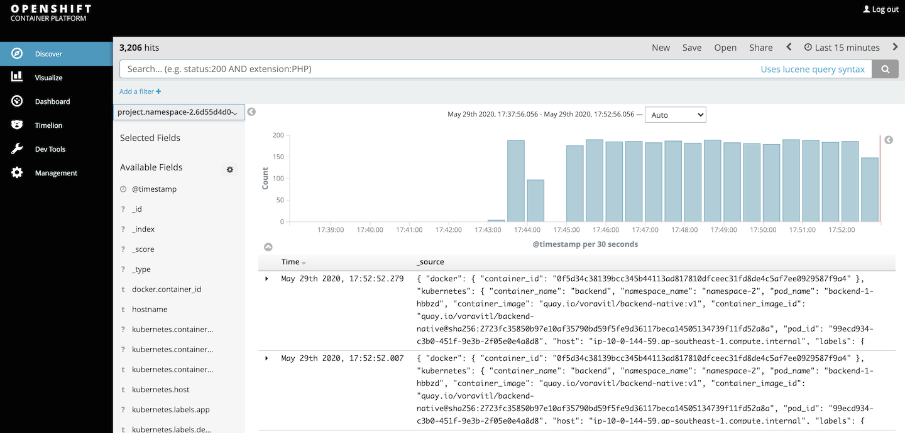

- Login to Kibana with Cluster Admin to check operator

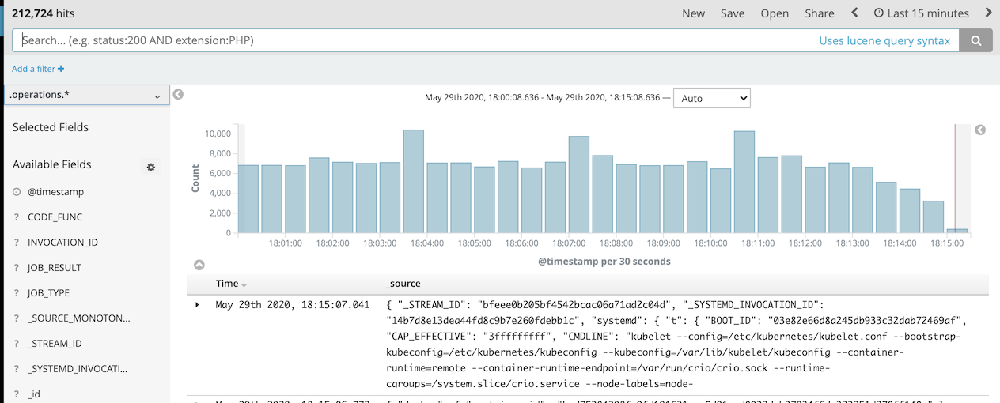

## Applications Metrics
- Create namespace for Prometheus and Grafana
```bash
oc login --insecure-skip-tls-verify=true --server=$OCP --username=opentlc-mgr
oc new-project user1-app-monitor --display-name="User1 - application monitor"
oc label namespace user1-app-monitor role=app-monitor
```
- Set network policy for namespace-2 to allow traffic from user1-app-monitor
```bash
oc apply -f artifacts/network-policy-allow-from-app-monitor.yaml -n namespace-2
```
- Setup Promethues in namespace user1-app-monitor by crete CRD resources
```bash

# Service Account steps need cluster admin roles.
oc login --insecure-skip-tls-verify=true --server=$OCP --username=opentlc-mgr
oc apply -f artifacts/prometheus-service-account.yaml -n user1-app-monitor
oc login --insecure-skip-tls-verify=true --server=$OCP --username=usr1
oc apply -f artifacts/prometheus-service-monitor.yaml -n user1-app-monitor
oc apply -f artifacts/prometheus.yaml -n user1-app-monitor
oc create route edge prometheus --service=prometheus --port=9090 -n user1-app-monitor
echo "https://$(oc get route prometheus -n user1-app-monitor -o jsonpath='{.spec.host}')"
```
- Setup Grafana in namespace user1-app-monitor by crete CRD resources
```bash
oc apply -f artifacts/grafana_datasource.yaml -n user1-app-monitor
oc apply -f artifacts/grafana.yaml -n user1-app-monitor
oc apply -f artifacts/grafana_dashboard.yaml -n user1-app-monitor
echo "https://$(oc get route grafana-route -n user1-app-monitor -o jsonpath='{.spec.host}')"
```
- Check Prometheus and Granfana on Developer Console

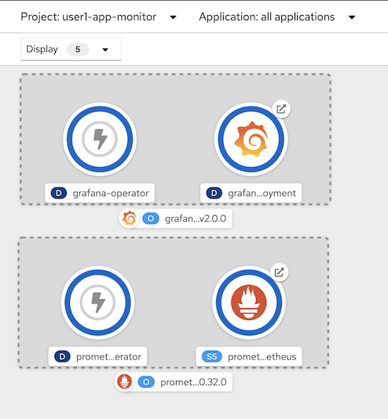

- Check prometheus console for Target and test query

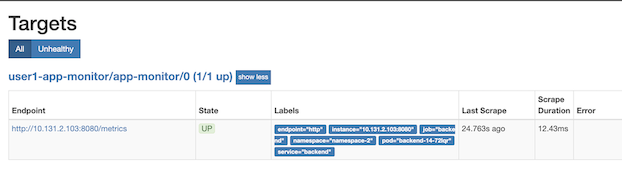

- Grafana Dashboard

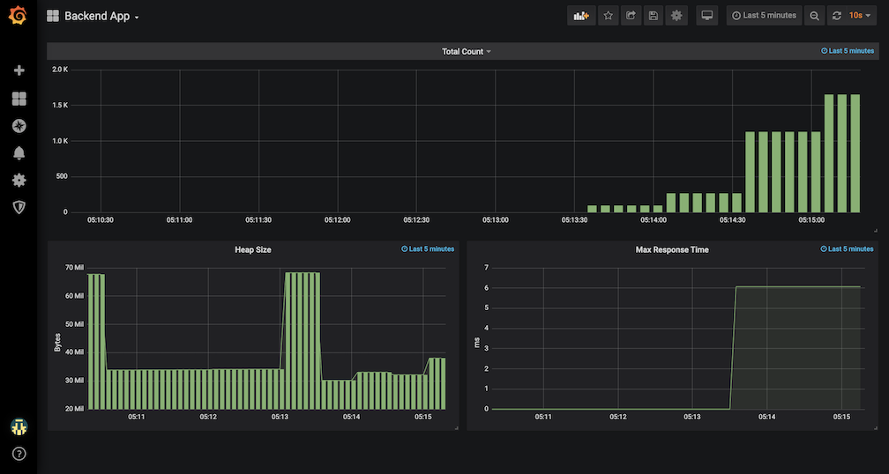
