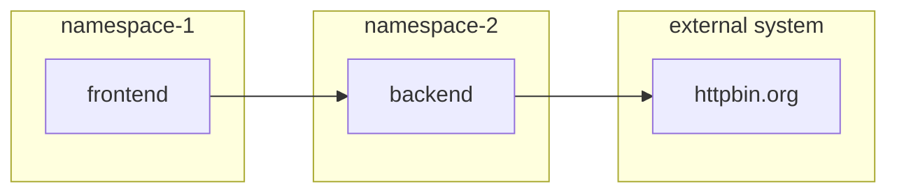

# Project (Tenant/Namespace) Management
<!-- TOC -->

- [Project (Tenant/Namespace) Management](#project-tenantnamespace-management)
  - [RESTful APIs](#restful-apis)
  - [Command Line with oc](#command-line-with-oc)

<!-- /TOC -->


- Create namespace for user1 and user2
  - user1 can edit namespace1 and namespace2
  - user2 can edit namespace3
- Assign quotas for all namespces



## RESTful APIs
- Get Token
```bash
TOKEN=$(oc whoami -t)
```
- Create project namespace-1
```bash
curl --verbose --insecure -location --request POST ${OCP}'/apis/project.openshift.io/v1/projectrequests' \
--header 'Accept: application/json' \
--header 'Content-Type: application/json' \
--header 'Authorization: Bearer '${TOKEN} \
--data-raw '{
    "kind": "ProjectRequest",
    "apiVersion": "project.openshift.io/v1",
    "metadata": {
        "name": "namespace-1",
        "creationTimestamp": null
    },
    "displayName": "Namespace 1"
}'
```
- Label project namespace-1
```bash
curl --verbose --insecure --location --request PATCH ${OCP}'/api/v1/namespaces/namespace-1' \
--header 'Accept: application/json' \
--header 'Content-Type: application/merge-patch+json' \
--header 'Authorization: Bearer '${TOKEN} \
--data '{"metadata":{"labels":{"name":"namespace-1"}}}'
```
- Assign user1 with role **edit** to namespace-1 
```bash
curl --verbose --insecure --location --request POST ${OCP}'/apis/authorization.openshift.io/v1/namespaces/namespace-1/rolebindings' \
--header 'Accept: application/json' \
--header 'Content-Type: application/json' \
--header 'Authorization: Bearer '${TOKEN} \
--data-raw '{
    "apiVersion": "authorization.openshift.io/v1",
    "kind": "RoleBinding",
    "metadata": {
        "name": "user1-edit-namespace-1",
        "namespace": "namespace-1"

    },
    "roleRef": {
        "apiGroup": "rbac.authorization.k8s.io",
        "kind": "ClusterRole",
        "name": "edit"
    },
    "subjects": [
        {
            "apiGroup": "rbac.authorization.k8s.io",
            "kind": "User",
            "name": "user1"
        }
    ]
}'
```
- Assign [size S quotas](artifacts/size-s-quotas.yaml) to namespace-1
```bash
curl --verbose --insecure --location --request POST ${OCP}'/api/v1/namespaces/namespace-1/resourcequotas' \
--header 'Accept: application/json' \
--header 'Content-Type: application/json' \
--header 'Authorization: Bearer '${TOKEN} \
--data-raw '{
  "apiVersion": "v1",
  "kind": "ResourceQuota",
  "metadata": {
    "name": "size-s-quotas",
    "namespace": "namespace-1"
  },
  "spec": {
    "hard": {
      "pods": "15",
      "requests.cpu": "1",
      "requests.memory": "1Gi",
      "limits.cpu": "4",
      "limits.memory": "4Gi",
      "requests.storage": "3Gi"
    }
  }
}'
```

## Command Line with oc
- Create namespace-2 for user1 and namespace-3 for user2
```bash
oc login --insecure-skip-tls-verify=true --server=$OCP --username=opentlc-mgr
oc new-project namespace-2 --display-name="Namespace 2"
oc label namespace namespace-2 name=namespace-2
oc new-project namespace-3 --display-name="Namespace 3"
oc label namespace namespace-3 name=namespace-3
oc policy add-role-to-user edit user1 -n namespace-2
oc policy add-role-to-user edit user2 -n namespace-3
```
- Assign [size S quotas](artifacts/size-s-quotas.yaml) to namespace-2 and namespace-3
```bash
oc apply -f artifacts/size-s-quotas.yaml -n namespace-2
oc apply -f artifacts/size-s-quotas.yaml -n namespace-3
```
