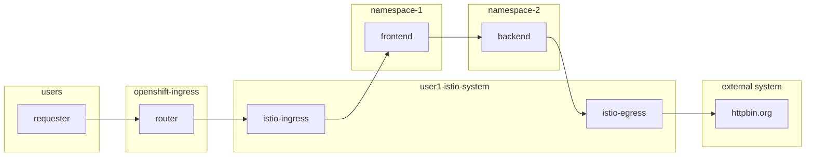
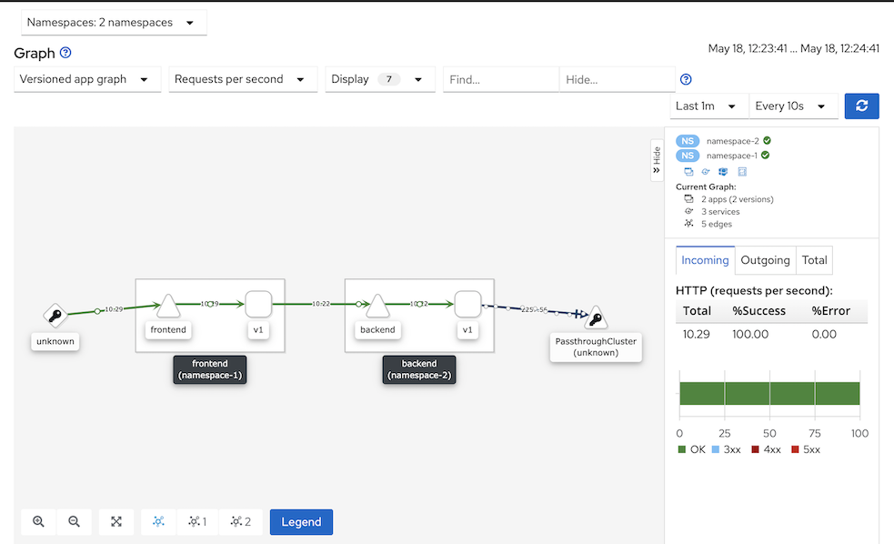
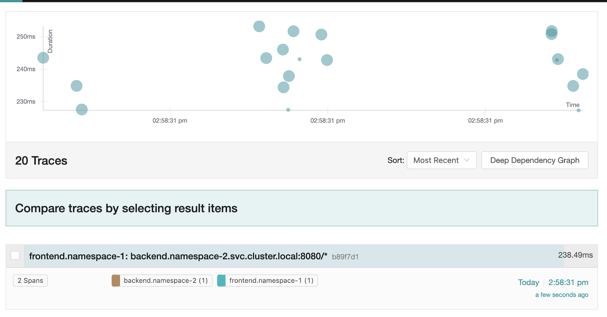
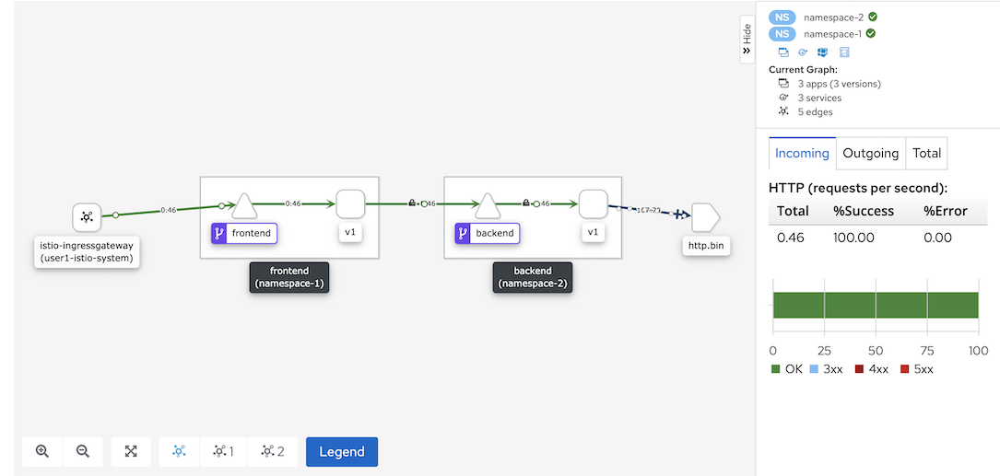

# Service Mesh
<!-- TOC -->

- [Service Mesh](#service-mesh)
  - [Control Plane](#control-plane)
  - [Observability with Kiali and Jaeger](#observability-with-kiali-and-jaeger)
  - [Secure Backend with mTLS](#secure-backend-with-mtls)
  - [Secure frontend with JWT](#secure-frontend-with-jwt)
  - [Service Mesh Egress Policy](#service-mesh-egress-policy)
  - [Cleanup Istio](#cleanup-istio)

<!-- /TOC -->


## Control Plane
- Create namespace for control plane
```bash
oc login --insecure-skip-tls-verify=true --server=$OCP --username=opentlc-mgr
oc new-project user1-istio-system --display-name="Service Mesh Control Plane for user1"
oc policy add-role-to-user edit user1 -n user1-istio-system
```
- Use cluster admin user to install following operators
  - ElasticSearch
  - Jaeger
  - Kibana
  - OpenShift Service Mesh
- Create control plane and join namespace-1 and namespace-2 to control plane
```bash
oc login --insecure-skip-tls-verify=true --server=$OCP --username=user1
oc apply -f artifacts/service-mesh-basic-install.yaml -n user1-istio-system
oc project user1-istio-system
watch oc get pods
oc apply -f artifacts/service-mesh-memberroll.yaml -n user1-istio-system
```
- Check network policy for namespace-1
```bash
oc get networkpolicy -n namespace-1

# Output
NAME                     POD-SELECTOR                   AGE
allow-from-namespace-1   app=backend                    6h19m
istio-expose-route       maistra.io/expose-route=true   18s
istio-mesh               <none>                         18s
```
- Inject sidecar by annotate sidecar.istio.io/inject to deployment config template.
```bash
oc patch dc frontend -p '{"spec":{"template":{"metadata":{"annotations":{"sidecar.istio.io/inject":"true"}}}}}' -n namespace-1
oc patch dc backend -p '{"spec":{"template":{"metadata":{"annotations":{"sidecar.istio.io/inject":"true"}}}}}' -n namespace-2
```
- Check that sidecar is injected to pod
```
oc get pods -n namespace-1
oc get pods -n namespace-2
```

## Observability with Kiali and Jaeger
- Run load test tool
```bash
siege -c 5 https://$(oc get route frontend -o jsonpath='{.spec.host}' -n namespace-1)
```
- Kiali graph displays application topology
  
  

- Jaeger trasaction tracing
  
  

## Secure Backend with mTLS
- Enable mTLS for backend by create destination rule and virtual service.
```bash
oc patch dc frontend -p '{"spec":{"template":{"metadata":{"annotations":{"sidecar.istio.io/rewriteAppHTTPProbers":"true"}}}}}' -n namespace-1
oc patch dc backend -p '{"spec":{"template":{"metadata":{"annotations":{"sidecar.istio.io/rewriteAppHTTPProbers":"true"}}}}}' -n namespace-2
oc apply -f artifacts/backend-destination-rule.yaml -n namespace-2
oc apply -f artifacts/backend-virtual-service.yaml -n namespace-2
oc apply -f artifacts/backend-authenticate-mtls.yaml -n namespace-2
```
- Create [dummy pod](artifacts/dummy.yaml) (without sidecar) on namespace-1 
```bash
oc apply -f artifacts/dummy.yaml -n namespace-1
```
- Connect ot dummy pod terminal and cURL to backend service
```bash
oc exec $(oc get pods -n namespace-1 | grep dummy | grep Running | head -n 1 | awk '{print $1}') -n namespace-1 -- curl http://backend.namespace-2.svc.cluster.local:8080
```
- Following error will be displayed
```bash
curl: (56) Recv failure: Connection reset by peer
```
- Connect to frontend pod terminal and cURL to backend service.
```bash
oc exec -c frontend $(oc get pods -n namespace-1 | grep frontend | grep Running | head -n 1 | awk '{print $1}') -n namespace-1 -- curl http://backend.namespace-2.svc.cluster.local:8080
```
- cURL to frontend's route to verify that route still working properly.

## Secure frontend with JWT
- Create [destination rule](artifacts/frontend-destination-rule.yaml), [gateway](artifacts/frontend-gateway.yaml) and [virtual service](artifacts/frontend-virtual-service.yaml) for frontend
```bash
oc apply -f artifacts/frontend-destination-rule.yaml -n namespace-1
oc apply -f artifacts/frontend-gateway.yaml -n namespace-1
oc apply -f artifacts/frontend-virtual-service.yaml -n namespace-1
echo "Istio Gateway URL=> https://$(oc get route istio-ingressgateway -o jsonpath='{.spec.host}' -n user1-istio-system)"
```
- Enable [JWT authorization](artifacts/frontend-jwt-with-mtls.yaml) for frontend
```bash
oc apply -f artifacts/frontend-jwt-with-mtls.yaml -n namespace-1
```
- Check generated token with [jwt.io](https://jwt.io)
- Test without JWT token, wrong JWT token and valid JWT token
```bash
curl -v http://$(oc get route istio-ingressgateway -o jsonpath='{.spec.host}' -n user1-istio-system)

# Unauthorized

# Origin authentication failed
curl -v -H "Authorization: Bearer $(cat artifacts/jwt-wrong-realms.txt)" http://$(oc get route istio-ingressgateway -o jsonpath='{.spec.host}' -n user1-istio-system)

# Unauthorized

# Origin authentication failed
curl -v -H "Authorization: Bearer $(cat artifacts/token.txt)" http://$(oc get route istio-ingressgateway -o jsonpath='{.spec.host}' -n user1-istio-system)

# Success
```

## Service Mesh Egress Policy
<!-- - Remove egress firewall
```bash
oc login --insecure-skip-tls-verify=true --server=$OCP --username=opentlc-mgr
oc delete -f artifacts/egress-namespace-2.yaml -n namespace-2
``` -->
- Set control plane configuration to disallow egress traffic by default
```bash
 oc get configmap istio -n user1-istio-system -o yaml \
  | sed 's/mode: ALLOW_ANY/mode: REGISTRY_ONLY/g' \
  | oc replace -n user1-istio-system -f -
```
- Create [egerss service entry](artifacts/egress-serviceentry.yml) to allow https request to httpbin.org
```bash
oc apply -f artifacts/egress-serviceentry.yml -n user1-istio-system
```
- Check kiali graph



- Set control plane to ALLOW_ANY
```bash
 oc get configmap istio -n user1-istio-system -o yaml \
  | sed 's/mode: REGISTRY_ONLY/mode: ALLOW_ANY/g' \
  | oc replace -n user1-istio-system -f -
```

## Cleanup Istio
- Remove sidecar
```bash
oc patch dc frontend -p '{"spec":{"template":{"metadata":{"annotations":{"sidecar.istio.io/inject":"false"}}}}}' -n namespace-1
oc patch dc backend -p '{"spec":{"template":{"metadata":{"annotations":{"sidecar.istio.io/inject":"false"}}}}}' -n namespace-2
```
- [Remove configurations](scripts/remove-all-istios.sh)
```bash
scripts/remove-all-istios.sh
```
